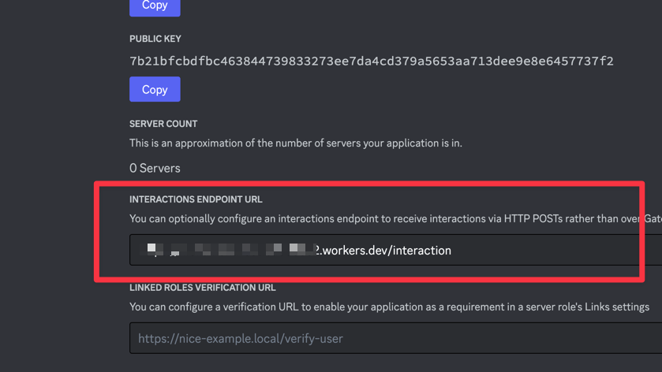

# kotobade-asobou-discord

言葉で遊ぼう BOT

## Stack

- Hono.js
- Cloudflare Workers

## 環境構築

1. 環境変数の設定

`.dev.vars`を作成して適切な値を割り当てます。

```bash
cp .dev.vars.example .dev.vars
```

2. コマンドの登録

Discord 上にコマンドを登録します。

```bash
pnpm run deploy:command
```

3. デプロイ

Cloudflare Workers にデプロイします。

```bash
pnpm run deploy
```

4. エンドポイントの登録

以下のようなフォーマットでエンドポイントを Discord に登録します。

```bash
https://{任意のアドレス}.workers.dev/interaction
```


